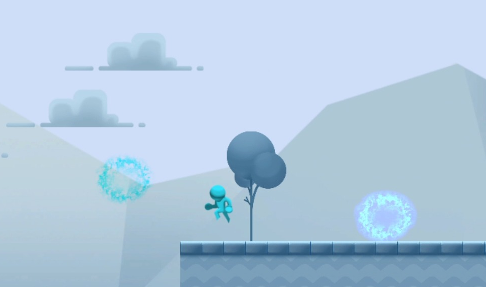
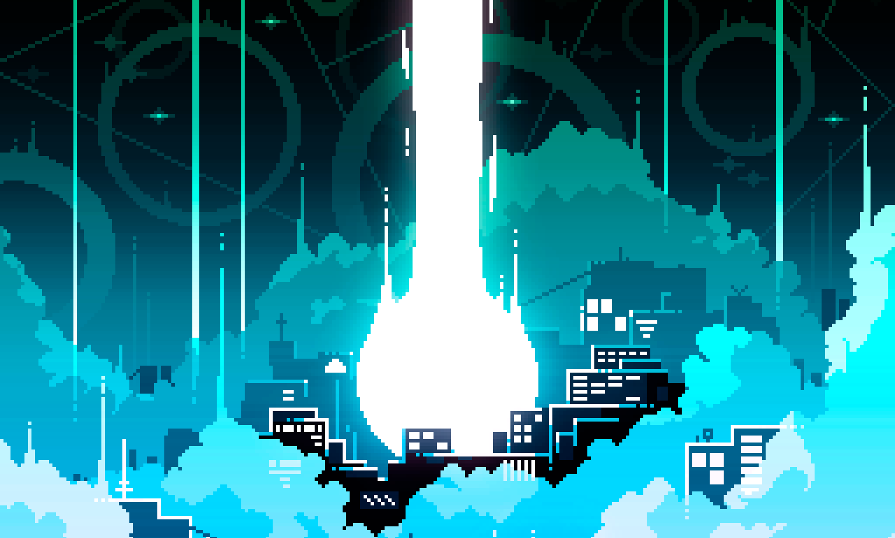

#  Hello, I am Marcos Romano Ibánez
### I'm Game Programer that have worked with Unreal Engine & Unity.

I studied an **Informatics Ingeniering Degree** at Burgos University. I focused my studies at university on **Sofware Ingeniering**.

After that I studied **Game Programming Master's Degree** at U-Tad, Madrid. In that master I learned the basics of how to make video games as well as the necessary knowledge to create your own game engine. Also I worked with **Unreal Engine** and **Unity** game engines.

For my master tesis I made a third person action-adventure game with othe 15 students named **Howl Of Iron**. Its was nice opportunity to work with a large team. together we bring out the best in ourselves to the point that we managed to win the award for **best game design** at the pstalents awards.
 
You can find it here: 
 
<a href="https://store.steampowered.com/app/2235790/Howl_of_Iron">Howl Of Iron</a>
 
And here a little interview were I talk about my experience working in this project: 
https://us.u-tad.com/2022/10/conoce-howl-of-iron-la-autentica-experiencia-hombre-lobo/
  
Currently I'm working in Pendulo Studio were I am working as Gameplay Programmer in **Tintin reporter - Cigars of the pharaoh**
 
You can find it here: 
https://store.steampowered.com/app/2125090/Tintin_Reporter__Los_Cigarros_del_Faraon/?l=spanish

##  About me

I love videogames. Since I was young I have always had a portable console or a controller in my hands. I have played games of almost any genre. My favorite game genres are **hack and slash** and **turn based** games. I specially love **Nier: Automata** and **God Of War**.

Furthermore I like **anime** and **table games**. I love so many animes I can't mention just one, but my favourite table game is **Magic The Gathering**.

##  Skills

 
 
 
 

##  My Projects

<table style="width:10%">
  <tr>
    <td>
	
	<a href="https://github.com/marckiarck/Howl-of-Iron">Howl Of Iron</a>
	</td>	   
	<td>
	
	<a href="https://github.com/marckiarck/mri1001-tfg">2D Platform Game (TFG)</a>
	</td>	  
	 <td>
	
	<a href="https://github.com/marckiarck/RogeLike">Rogue Paloma</a>
	</td>	 
	<td>
	
	<a href="https://github.com/marckiarck/practica-dms-2020-2021">University Practice (Sofware Ingeniering)</a>
	</td>	
  </tr>
</table>

##  Social Networks
 

##  Contact 

 
